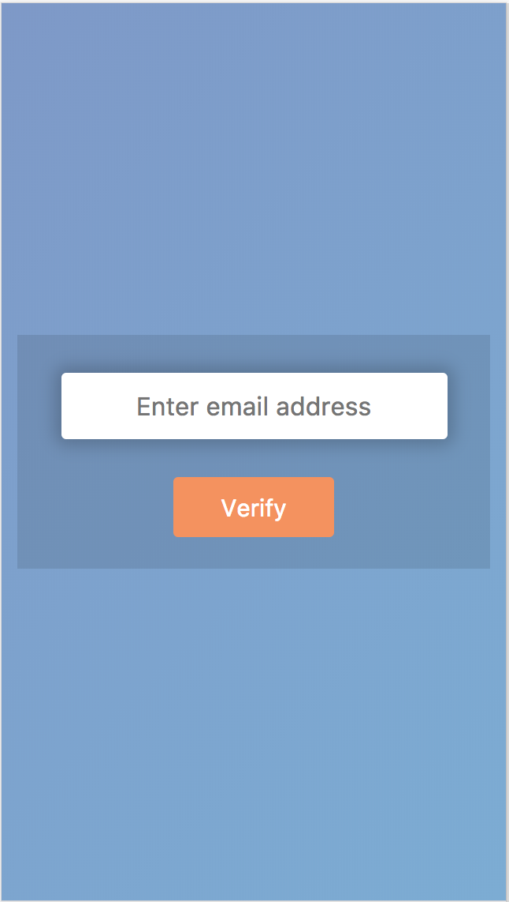
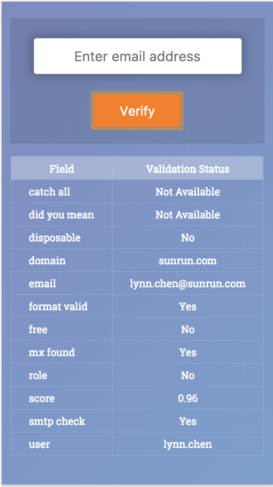
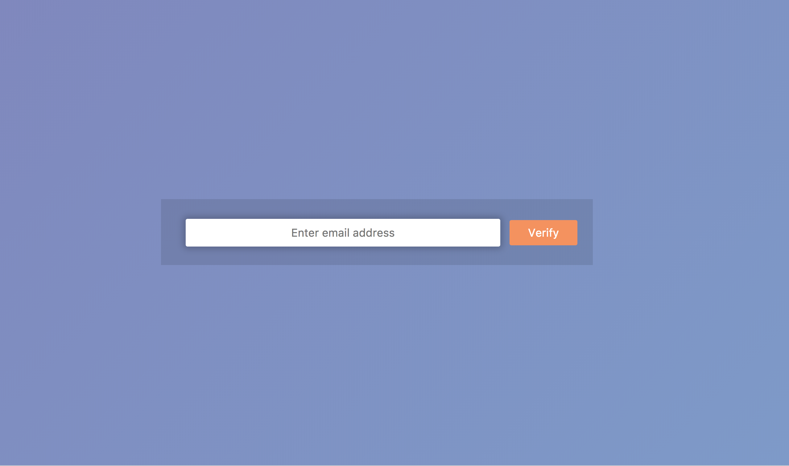
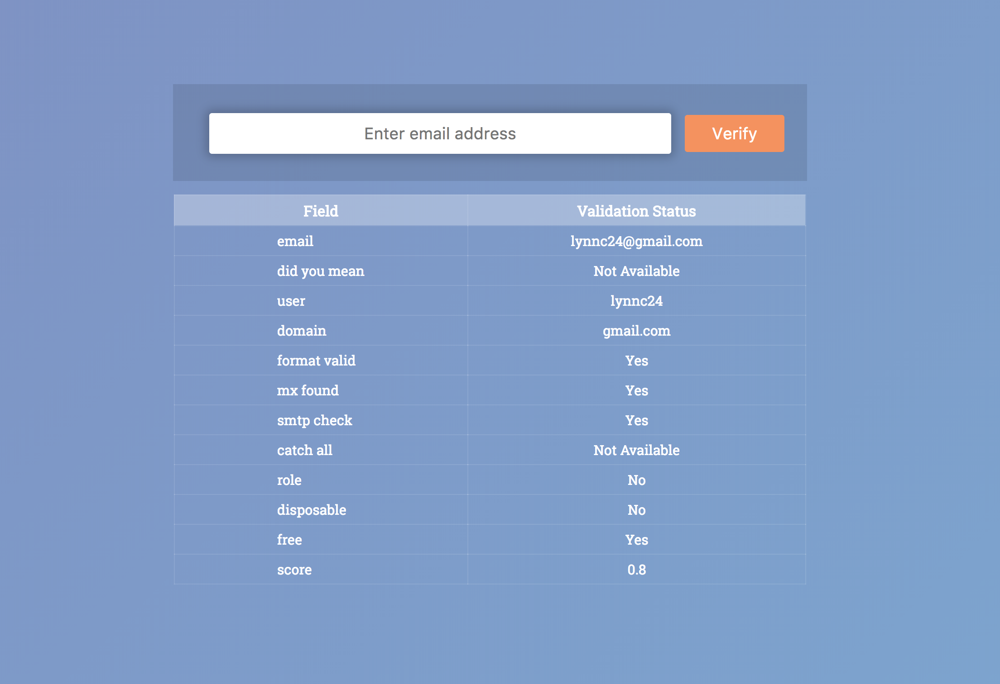

# Email Validation App

This app enables users to validate the value of the email field using the REST api provided by Mailboxlayer.

## Table of Contents

1. [Demo](#Demo)
1. [Tech Stack](#tech-stack)
1. [Development](#development)
    1. [Installing Dependencies](#installing-dependencies)
    1. [Setup](#setup)

## Demo
Responsive desktop and mobile app. Visit [Email Validation App](https://lynnc24.github.io) and input an email address to get started. (Please click on the images to expand.)

  
  
  
  

## Tech Stack

- Node
- Express
- Webpack
- React
- Docker

## Development

Please run the commands below in the project directory.

### Installing Dependencies

### `yarn install`

### Setup

### `yarn dev`

Runs the app in the development mode. 
Open [http://localhost:3000](http://localhost:3000) to view it in the browser.

The page will reload if you make edits. 
You will also see any lint errors in the console.

### `yarn build`

Builds the app for production to the `build` folder. 
It correctly bundles React in production mode and optimizes the build for the best performance.

The build is minified and the filenames include the hashes. 
Your app is ready to be deployed!

### Docker image
docker container run -it -p 8080:3000 email-validation-app-lc
Open [http://localhost:8080](http://localhost:8080) to view it in the browser.

README.md

This project was bootstrapped with [Create React App](https://github.com/facebookincubator/create-react-app).
